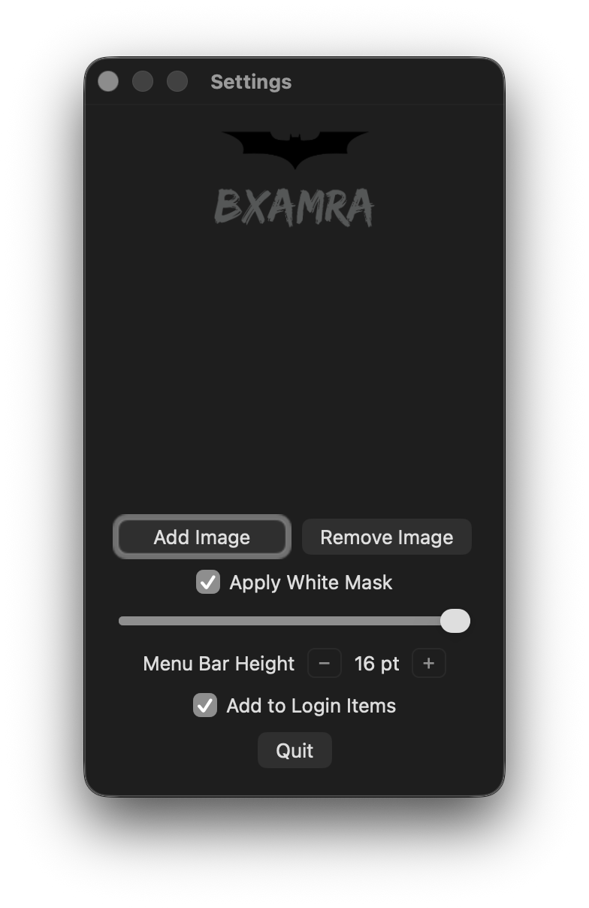

# 🖼️ Ikonic MenuBar

A minimalist macOS menubar app that displays any PNG image (like a logo or tag) as the menubar icon, with a scrollable image list and adjustable height controls.

---

## ✨ Features

- Custom PNG image shown as the menubar icon using NSStatusBar/NSStatusItem.
- Right‑click the menubar icon to open the Settings window and manage images and preferences.
- Scrollable, vertically stacked image previews powered by NSScrollView + NSStackView with Auto Layout.
- **−/+ height controls** to fine‑tune the menu bar image height in points with instant preview and persistence.
- Optional white visibility mask with a strength slider to improve contrast on different menu bar appearances.
- Remembers selected image, height, overlay, and launch‑at‑login preference using UserDefaults.
- Left/right padding in the Settings window so sliders and buttons don’t touch the edges, using stack view edgeInsets and row padding.

---

## 📷 Screenshot

Screenshot of the menubar icon and Settings window.




---

## 🚀 Usage

1. Launch the app; a placeholder icon appears in the menu bar.
2. Right‑click the icon to open Settings.
3. Click “Add Image” and pick a `.png`, `.jpeg`, `.gif`, or `.tiff` file; it appears in the scrollable list.
4. Click an image preview to select it as the menubar icon; the choice is saved automatically.
5. Use the **−** and **+** buttons next to “Menu Bar Height” to adjust the displayed height in point increments.
6. Toggle “Apply White Mask” and adjust the strength slider to improve visibility if needed.
7. Optionally enable “Add to Login Items” to start the app at login.

---

## ⚙️ Settings Details

- Image List: Vertical NSStackView inside an NSScrollView with Auto Layout so long lists remain scrollable and responsive.
- Height Control: Two buttons (− / +) change the stored height in 1‑pt steps and update the preview instantly.
- Overlay: Checkbox enables a white mask; the strength slider blends white over the rendered icon for clarity.
- Layout: The Settings window has left/right padding and padded rows so controls never touch the edges.

---

## 🛠️ Technical Overview

- Built with **Swift** and **AppKit**.
- Uses `NSStatusBar`/`NSStatusItem` for menubar integration and `NSOpenPanel` for image selection.
- Scrolling implemented by pinning the document view to the clip view and matching widths for vertical overflow.
- Preferences stored in `UserDefaults` (selected image, overlay enabled/strength, height, launch at login).
- Custom rendering keeps height fixed and caps width at 3× height to maintain a compact menubar footprint.

---

## 🧪 Build & Run

### Prerequisites

- macOS.
- Xcode.

### Steps

1. Clone the repo: `git clone https://github.com/BXAMRA/Ikonic-MenuBar.git`.
2. Open the project: `open "Ikonic MenuBar.xcodeproj"`.
3. Build and run using the “My Mac” scheme.

---

## 📦 Locate the .app File

### After building

- In Xcode, go to Products → Ikonic MenuBar.app → Show in Finder.

### Or locate manually

```
~/Library/Developer/Xcode/DerivedData/Ikonic_Menubar-.../Build/Products/Debug/Ikonic MenuBar.app
```

---

## 📝 License

MIT License — feel free to use, modify, or contribute.

---

## 🙌 Credits

Made with ❤️ using Swift and AppKit by [BXAMRA](https://github.com/BXAMRA).
